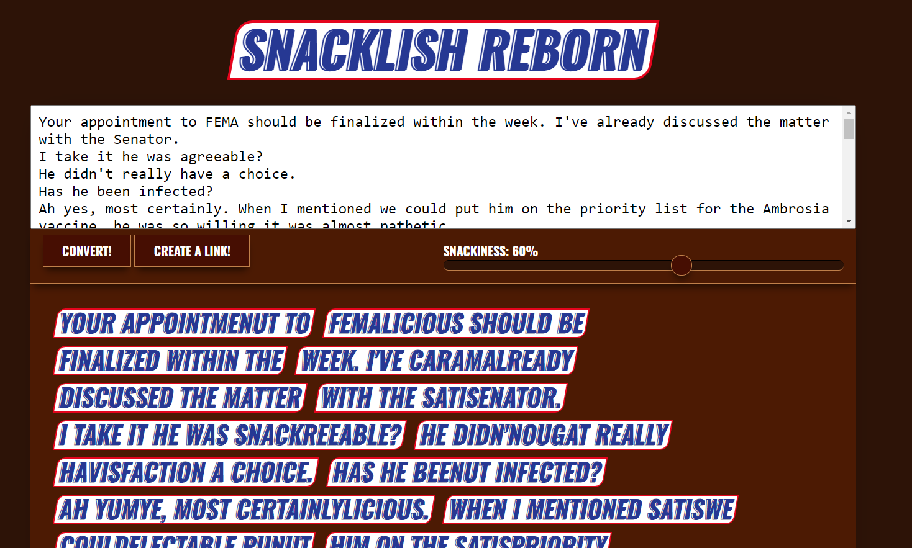
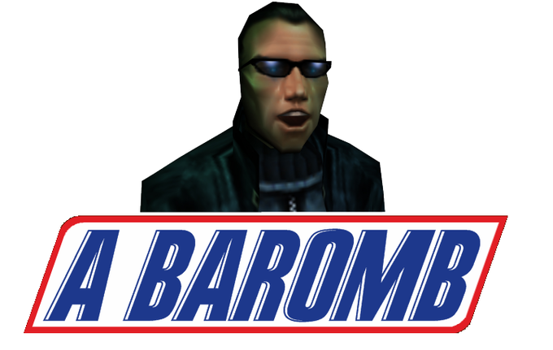

# Snacklish Reborn

See it live here: <https://snacklishreborn.tgratzer.com/>

Generate Snacklish text. You can just chuckle at the content, or create a permalink to the rendered text. The created link has a transparent background, so you can use it for purposes such as embedding a browser source into your Twitch stream, embedding an iframe into your page, taking a clean screenshot, etc.

## What?

Originally created by [AnnoyedGrunt](https://github.com/AnnoyedGrunt/snacklishreborn). They describe it as such:

> In the year 2009, Snickers released the Snacklish website as part of a promotional campaign. The website, powered by Flash, promised to transform any piece of English text into a much more delicious equivalent. The website was noticed by 4chan in 2013, leading to its rise into meme-relevancy, and spawning images such as this:

> Unfortunately, the website was shut down sometime in 2014. Now I remade it. I never had the chance to use it when it was available, so I went on KnowYourMeme and manually recorded any word I found in the 40 or so meme images they have recorded. Then I looked at these 270~ words and tried to figure out the replacement rules. I think I came somewhat close, all things considered. Largest difference, probably, is that I believe the original Snacklish was deterministic, while this one is random - if there are multiple rules that could apply to the same word, one is picked randomly. I beg for forgiveness for the inaccuracy of my memercheological efforts.
